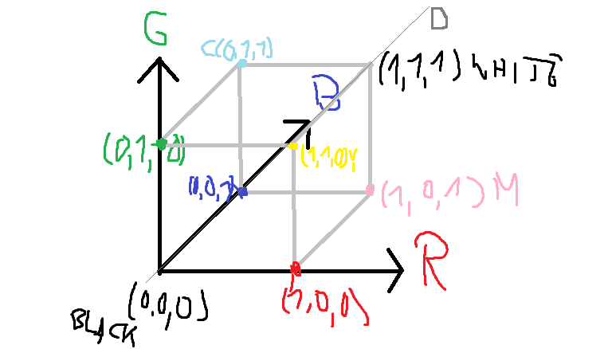

# Input
Any image file of reasonable format and size
Current: .png and .bmp and max 1920x1080
# Outuput
Sequence of images cycling through RGB values.

# Transformations:

## General
Imagine RGB space as a Unit cube of percentages. Define line D 
(0, 0, 0) + a*(1, 1, 1)

define a partition angle f such that 360/f = n is the number of images to create.

define the rotation matrix M such that for any point P, MP is f degrees rotated along the axis D.

taken from [wikipedia](https://en.wikipedia.org/wiki/Rotation_matrix#Rotation_matrix_from_axis_and_angle)

requires a unit vector (u, u, u)= U = (u_x,u_y,u_z) such that
u_x^2 + u_y^2 + u_z^2 = 1 = 3 u^2
u^2 = 1/3
u = 1/sqrt(3)

## point specific
For any given point P = (p1, p2, p3), find the height 0 <= h <= 1 such that A = P - (h, h, h) is perpendicular to D. 

### working out
(p1-h, p2-h, p3-h) PERP (1,1,1) 
=> p1-h + p2-h +p3-h = 0
=> p1+p2+p3 = 3*h
=> h = mean(p)

Define vector H = (h, h, h)

Consider the line C = H + c*A

Find the intersections i1, i2, i3 of C with the three planes with normals e1, e2, e3.
### working out
C = (h + c*(p1-h), h + c*(p2-h), h + c*(p3-h))
each coordinate is either 0 or 1 for 6 possibilities.
ASSUME h != p_v
0-part:
h + c*(p_v - h) = 0 
=> 
-h = c*(p_v - h) 
=> 
c = -h/(p_v - h) = h/(h- p_v)
1-part: 
h + c*(p_v-h) = 1
=>
1 - h = c*(p_v-h)
=>
c = (1-h)/(p_v-h)

L = 1.5
1

Determine the right one (current guess is the one in the middle ), call it B = (b1, b2, b3).
At least one of b1, b2, b3 will be 0 or 1 

find percentage 0 <= t <= 1 such that P is t% along the path from H to b

## Transforming the point
q = M*p
K = H + r*(q-H) 
Get intersection points
find right point c
determine length L_2 = ||H + c*(q-H) ||
find r such that ||r*(q-H) || is t*L2
### working out
r||(q-H)|| = (t*L_2)^2
r = (t*L_2)^2/||(q-H)||

scale up p_new = H + r*(q-H)

